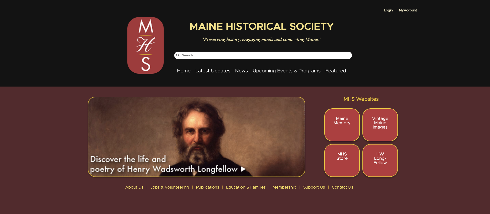
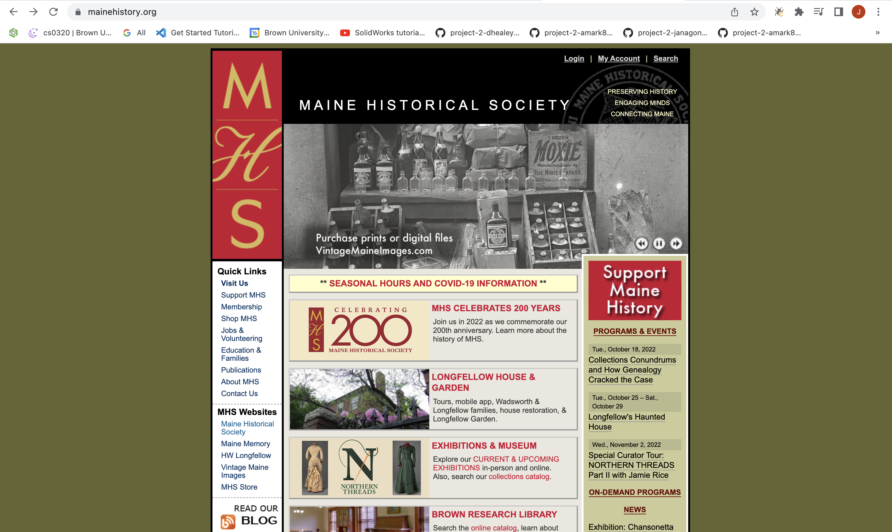
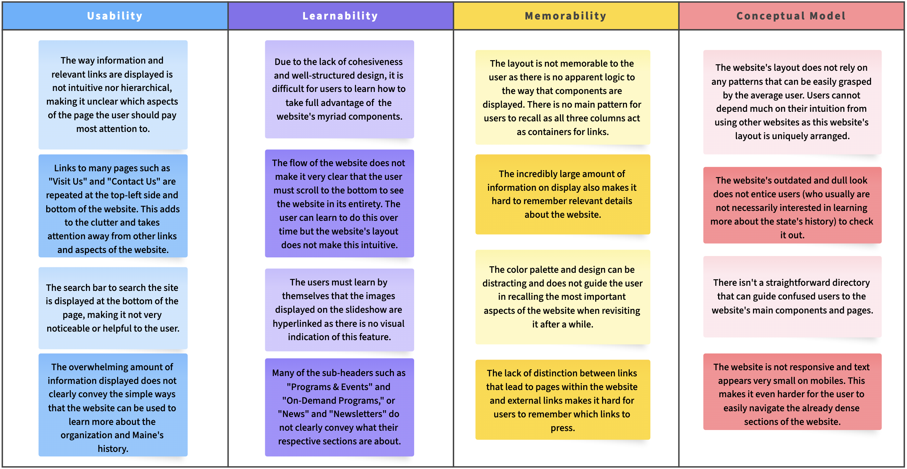
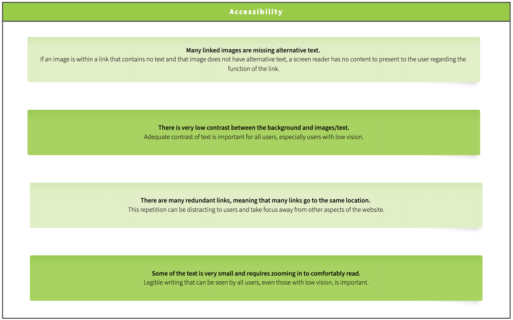

# Responsive Redesign

I redesigned the website for the Maine Historical Society in order to present a cleaner, more concise and accessible alternative.

*The redesign is live [here](https://johnnyboustany.github.io/Responsive-Redesign/).*

    

## Table of Contents
* [Technologies Used](#technologies-used)
* [General Info](#general-info)
* [User Research](#user-research)
* [Design Iterations](#design-iterations)
* [Conclusion](#conclusion)
* [Project Status](#project-status)
<!-- * [License](#license) -->

## Technologies Used
JavaScript, Figma

## General Info
I chose to redesign the[ Maine Historical Society](https://www.mainehistory.org/)’s website as I have always been frustrated with many aspects of the front webpage. I have friends from Maine and have always been interested in learning more about the state's history. However, the website’s design makes it difficult to access important resources needed to learn more about Maine’s history and the MHS. I am eager to propose a sleek, simple, and improved redesign.

    
     
    above: Shows the old Maine Historical Society website. The website has been updated since.

## User Research

Before creating low and high fidelity models and redesigning the website, I identified the main user problems that can arise when using it. I chose these user problems based on my major frustrations with the website as a frequent user of it. I also used [WebAIM WAVE](https://wave.webaim.org/) to identify any accessibility problems. The figures below present the main user and accessibility problems.

    
     
    above: Showing the user problems.

    
     
    above: Showing the accessibility issues.

## Design Iterations

To start planning for making the website responsive, I created low fidelity designs for three screens (laptop, mobile & tablet) using Balsamiq. The low-fi sketch for laptops is shown below along with annotations explaining the choices I made.

    
     
    above: Showing the accessibility issues.

I decided to reduce the number of links and information displayed on the front-page. The trade-off has to do with the risk of possibly removing important information. However, I believe this change is for the best as the large number of links makes it difficult to find resources on the website. By reducing the repetition of links and opting for a simpler design, I make it easier for users to find what they are looking for.

Based on the low-fi designs, I created the high-fidelity prototypes on Figma, one for each device type. The original website was redesigned using these figma prototypes. The figma prototype for mobile screens is shown below.

[Link to Figma Prototype](https://www.figma.com/proto/MiOkx6UgV0Ac2NjPN403jw/Redesign?page-id=205%3A274&node-id=205%3A380&viewport=435%2C-120%2C0.25&scaling=scale-down)

I used the style guide and design I developed in Figma to develop the website using JavaScript.

## Conclusion

This project made me appreciate Balsamiq and Figma a lot more as I realized that both tools make it much easier to make nicely designed websites. I did not have to worry about design choices when I was coding as I had my Figma designs as reference. Hence, I was able to focus on using “flex” to make my design responsive. I learned how to make a website responsive as I code it part by part.

## Project Status
Project is: Complete (as of December 2022)
